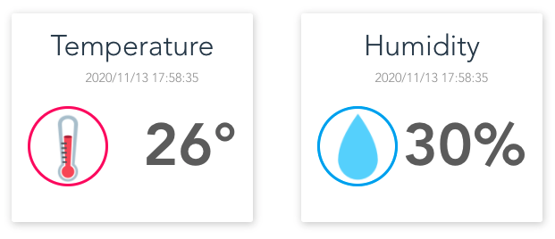

# Pixelab IoT Lab

[](https://en.wikipedia.org/wiki/Internet_of_things)


DHT22 сенсорын утгыг Google Firebase сервисээс авч дэлгэцэнд харуулж буй Vue.js framework дээр суурилсан прожект юм.

# Юу мэдэх шаардлагатай вэ!

  - Vue.js
  - Google Firebase, Firestore database, Bootstrap
  - Arduino ESP8266 WiFi board
  - Google Cloud Function нь API сервис болж ажиллаж байгааг анхаарна уу.


> Энэхүү прожект нь 3 үндсэн хэсгээс бүрдэх бөгөөд
> үүнд Vue.js (Front-ent), Cloud function (API сервис),
> Arduino дээрх програм гэсэн IoT технологийн 
> Бүхий л давхаргийг хамарсан прожект болой.


Нээлттэй эх учир та өөрийн Firebase аккаунтын service key-ээ холбоод ажиллуулж болно.

# Харагдах байдал



## Front-end-г ажиллуулах комманд
```
cd frontend
npm install
```

### Compiles and hot-reloads for development
```
npm run serve
```
